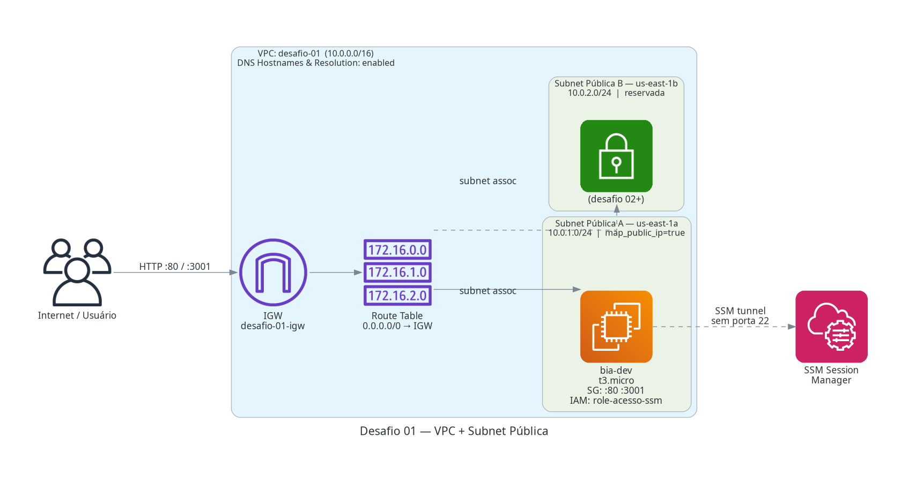
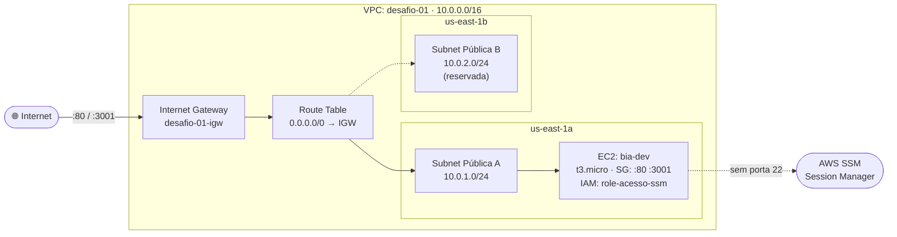

# 🚀 Desafio 01: VPC + Subnet Pública

> Lançar a máquina de trabalho `bia-dev` em uma subnet pública customizada. Criar VPC, subnets, route table e internet gateway do zero — sem depender da VPC default.

[](https://www.terraform.io/)
[](https://aws.amazon.com/)
[](#)
[](#)

---

## 📋 Sobre o Desafio

| Campo | Valor |
|---|---|
| **Número** | 01 |
| **Trilha** | Conectividade e Redes na AWS (Mai/2026) |
| **Nível** | ⭐ Iniciante (Não linear) |
| **Data limite do post** | 18/05/2026 |
| **Carga estimada** | 11h33 |
| **Tag identificadora** | `Challenge=mai2026-desafio-01` |
| **Repositório** | [formacao-aws-desafios-conectividade-redes-aws](https://github.com/nilo-lima/formacao-aws-desafios-conectividade-redes-aws) |

## 🏗️ Arquitetura

```text
desafio_01_vpc/
├── ai/ADR/          # Architecture Decision Records (5 ADRs)
├── terraform/       # main.tf + data.tf + ec2.tf (consome shared/modules/vpc)
│   ├── main.tf      # module "vpc"
│   ├── ec2.tf       # aws_security_group + aws_instance
│   ├── data.tf      # data sources: AMI AL2023 + IAM profile
│   ├── locals.tf    # common_tags (7 tags Well-Architected)
│   ├── variables.tf
│   ├── outputs.tf
│   └── versions.tf
├── docs/
│   ├── architecture.py   # script para gerar o diagrama
│   └── architecture.png  # diagrama da topologia
├── scripts/         # user_data_ec2_zona_a.sh, validate.sh, cleanup.sh
├── Makefile         # init, plan, apply, destroy, diagram, validate
└── README.md        # Este arquivo
```



### Diagrama de Fluxo



### Recursos provisionados (apply — 2026-05-13)

| Recurso | ID / Valor |
|---|---|
| VPC | `vpc-0d3fbc89334f08214` |
| Subnet pública-a (us-east-1a) | `subnet-0cca8bd5e6c93e9eb` · 10.0.1.0/24 |
| Subnet pública-b (us-east-1b) | `subnet-0884d5c3a637872a5` · 10.0.2.0/24 |
| Internet Gateway | `igw-0507bf67219e55cc3` |
| Route Table | `rtb-0edd62836444b4872` |
| Security Group | `sg-079303316ade98bc3` · bia-dev |
| EC2 bia-dev | `i-0ef9363c5f4d0b985` · `3.235.128.30` |
| AMI | `ami-0236886b69bdc43a8` · Amazon Linux 2023 |

## 🧠 Justificativa das Decisões Técnicas (ADRs)

Detalhes completos em [`ai/ADR/`](ai/ADR/).

- **ADR-001 — Módulo `shared/modules/vpc`:** Reutiliza o módulo testado do monorepo para criar toda a camada de rede (VPC, subnets, IGW, route table) com consistência entre desafios.
- **ADR-002 — SG bia-dev recriado na nova VPC:** Security Groups são VPC-específicos — o SG existente na VPC default não pode ser reutilizado. Criado novo com mesmas regras; IAM profile referenciado via `data source`.
- **ADR-003 — EC2 diretamente em `ec2.tf` sem `bia-baseline`:** O módulo `bia-baseline` criaria IAM resources que já existem na conta (conflito) e não expõe `key_name` nem `user_data` customizado.
- **ADR-004 — BIA clonada de `nilo-lima/bia.git`:** O PRD exige exclusivamente `https://github.com/nilo-lima/bia.git` como fonte da aplicação.
- **ADR-005 — Acesso via SSM sem porta 22:** IAM profile `role-acesso-ssm` habilita SSM Session Manager; porta 22 não exposta — superfície de ataque reduzida.

## 🚀 Guia de Execução

### Pré-requisitos

- AWS CLI configurado (`aws sts get-caller-identity`)
- Terraform >= 1.5 instalado
- IAM Instance Profile `role-acesso-ssm` existente na conta
- Key pair `test-key` cadastrado em `us-east-1`
- Variáveis em `terraform/terraform.tfvars` (copiar de `.example`)

### Passo a passo

```bash
make init       # terraform init
make plan       # terraform plan (revisar mudanças)
make apply      # terraform apply (pede confirmação)
make diagram    # gera docs/architecture.png
make validate   # smoke tests
make destroy    # destruir recursos (dupla confirmação)
```

### Targets disponíveis

| Target | Descrição |
|---|---|
| `init` | `terraform init` |
| `plan` | `terraform plan` |
| `apply` | `terraform apply` (requer aprovação explícita) |
| `diagram` | gera `docs/architecture.png` via lib `diagrams` |
| `validate` | `tflint` + `tfsec` + smoke tests |
| `destroy` | `terraform destroy` (dupla confirmação) |

### Acessar a instância (sem SSH)

```bash
# Via SSM Session Manager
aws ssm start-session --target i-0ef9363c5f4d0b985 --region us-east-1

# Smoke test da API BIA
curl -s http://IP_EC2:3001

# Verificar containers na instância (via SSM como root)
docker ps
```

## 🔐 Segurança & Tags

Todo recurso carrega **7 tags Well-Architected** via `locals.common_tags`:

```hcl
locals {
  common_tags = {
    Project      = "formacao-aws"
    Environment  = "lab"
    Owner        = "nilo-lima-jr"
    ManagedBy    = "terraform"
    Challenge    = "mai2026-desafio-01"
    CostCenter   = "formacao-aws-mai2026"
    AutoShutdown = "true"
  }
}
```

**Security Group `bia-dev`:**

| Direção | Porta | Origem | Propósito |
|---|---|---|---|
| Ingress | 80/TCP | 0.0.0.0/0 | Frontend Vite |
| Ingress | 3001/TCP | 0.0.0.0/0 | API Express BIA |
| Egress | All | 0.0.0.0/0 | Saída irrestrita |
| ~~22/TCP~~ | — | — | **Não exposta** (SSM) |

**IMDSv2 obrigatório** na EC2 (`http_tokens = "required"`) — mitiga SSRF contra o metadata endpoint.

## 💰 Custos Reais Apurados

| Serviço | Custo USD | Período |
|---|---:|---|
| EC2 t3.micro | ~$0.02 | ~2h de execução |
| EBS gp3 20 GB | ~$0.002 | ~2h de execução |
| Transferência | < $0.01 | smoke tests |
| NAT Gateway | $0.00 | Não usado neste desafio |
| RDS | $0.00 | Não usado neste desafio |
| **Total da sessão** | **~$0.03** | |


## 🤖 Validação com Kiro CLI

Perguntas usadas para auditar a infraestrutura após o deploy:

```
1. Liste todos os recursos AWS criados pela tag Challenge=mai2026-desafio-01 agrupados por serviço.
2. As 2 subnets têm map_public_ip_on_launch=true? Confirme os AZs: us-east-1a e us-east-1b.
3. A route table tem rota 0.0.0.0/0 apontando para o internet gateway?
4. As duas subnets estão associadas à mesma route table?
```

## 📈 Próximos Passos

- [x] Fase 1 — Design & ADRs
- [x] Fase 2 — Terraform (9 recursos)
- [x] Fase 4 — Validação (SSM + curl + docker ps)
- [x] Fase 5 — Documentação & Publicação
- [x] `make destroy` após publicação
- [ ] Desafio 02 — VPC + ECS público (multi-AZ, alta disponibilidade)

## 🎓 Lições Aprendidas

1. **Security Groups são VPC-específicos** — não é possível reutilizar um SG de uma VPC em outra. A solução é recriar com as mesmas regras (ADR-002).
2. **IMDSv2 é a forma segura de acessar metadados na EC2** — o token com TTL protege contra ataques SSRF que tentam roubar credenciais pelo endpoint 169.254.169.254.
3. **SSM elimina a necessidade de gerenciar chaves SSH** — com o IAM role correto, `aws ssm start-session` é mais seguro, auditável e conveniente do que SSH tradicional.
4. **Módulos Terraform reutilizáveis reduzem erro humano** — o módulo `shared/modules/vpc` encapsulou toda a complexidade de rede em ~5 linhas no `main.tf` do desafio.

---

## 💖 Apoie este Projeto Open Source

Se você gosta dos meus projetos, considere:

- 🏆 Me indicar para o GitHub Stars: [Indicar Aqui](https://stars.github.com/nominate/)
- ⭐ Dar uma estrela no repositório
- 🐛 Reportar bugs ou melhorias
- 🤝 Contribuir com código
- 🐈‍⬛ Visitar meu perfil: [@nilo-lima](https://github.com/nilo-lima)

## ⚖️ Licença

Distribuído sob a licença **Apache 2.0**. Veja [LICENSE](../LICENSE) na raiz.

---

<div align="center">
  <sub>
    Desafio 01 de 6 · Trilha
    <strong>Conectividade e Redes na AWS</strong>
    · Mentoria
    <a href="https://hotmart.com/pt-br/club/formacaoaws">Formação AWS 5.0 — Henrylle Maia</a>
  </sub>
</div>
