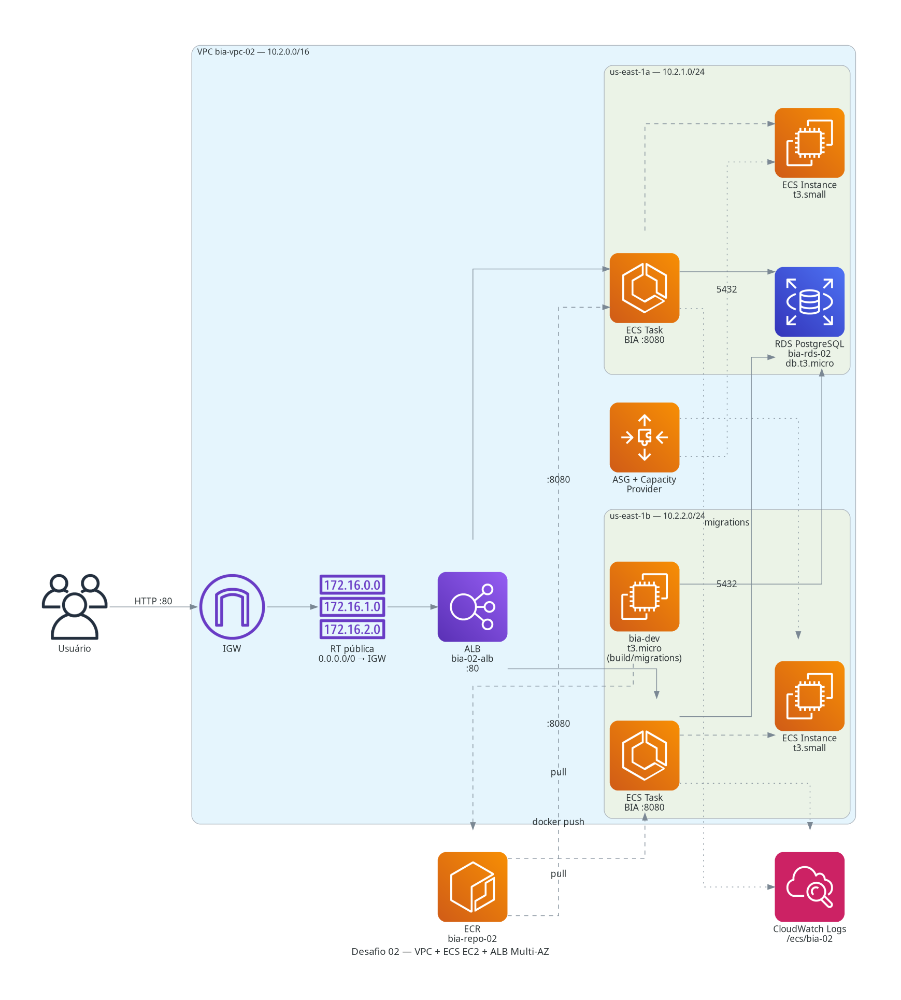
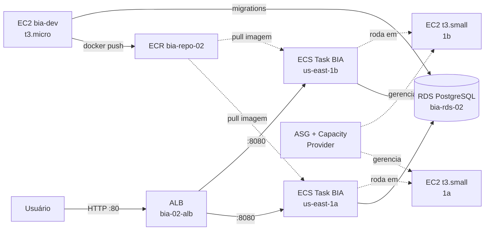

# 🚀 Desafio 02: VPC + ECS EC2 + ALB Multi-AZ

> Configurar a BIA para operar com ECS numa subnet pública customizada. Criar VPC customizada com 2 AZs e lançar a BIA em alta disponibilidade via ECS EC2 launch type + ALB + ASG.

[](https://www.terraform.io/)
[](https://aws.amazon.com/)
[](#)
[](#)

---

## 📋 Sobre o Desafio

| Campo | Valor |
|---|---|
| **Número** | 02 |
| **Trilha** | Conectividade e Redes na AWS (Mai/2026) |
| **Nível** | ⭐⭐ (Não linear) |
| **Data limite do post** | 25/05/2026 |
| **Carga estimada** | 1 dia, 3h41 |
| **Custo real apurado** | ~$0.23 (sessão de ~3h) |
| **Tag identificadora** | `Challenge=mai2026-desafio-02` |

---

## 🏗️ Arquitetura

```text
desafio_02_ecs_publico/
├── ai/              # PRD.md, ADRs, decisões de arquitetura
├── terraform/       # IaC modular (vpc, bia-baseline, alb)
├── ansible/         # Playbook pós-deploy (referência)
├── docker/          # docker-compose.yml (dev local)
├── docs/            # architecture.py, architecture.png, PRINTS/
├── scripts/         # build-push.sh, cleanup.sh, user_data_ecs_instances.sh
├── Makefile         # Targets: init, plan, apply, destroy, diagram
└── README.md        # Este arquivo
```



### Diagrama de Fluxo



---

## 🧠 Decisões Técnicas (ADRs)

- **ADR-001 — EC2 launch type, não Fargate:** Escolha deliberada para aprender a configurar Capacity Provider, ASG e ECS agent nas instâncias EC2. Fargate seria mais simples, mas abstrai conceitos importantes cobrados no desafio 04.
- **ADR-002 — VITE_API_URL baked no build:** O React (Vite) compila variáveis de ambiente em arquivos estáticos. Não é possível injetar `VITE_API_URL` em runtime — ela precisa ser definida como `ARG` no Dockerfile e passada via `--build-arg` no momento do build.
- **ADR-003 — ALB DNS como VITE_API_URL:** Usar o DNS do ALB garante que o frontend acesse a API via load balancer (alta disponibilidade), não via IP fixo de uma task específica.
- **ADR-004 — RDS Single-AZ em lab:** Multi-AZ duplicaria o custo do RDS (~$0.034/h → ~$0.068/h) sem benefício real para um lab de curta duração. O PRD prevê `desired_count=2` para as tasks, não para o banco.
- **ADR-005 — bia-dev em subnet pública:** Sem NAT Gateway neste desafio, a instância de build precisa de acesso à internet direto (subnet pública + public IP) para fazer pull do repo GitHub e push para ECR.

Detalhes completos em [`ai/ADR/`](ai/ADR/).

---

## 🚀 Guia de Execução

### Pré-requisitos

- Credenciais AWS configuradas (`aws sts get-caller-identity`)
- Terraform >= 1.5 instalado
- Python 3 + lib `diagrams` (`pip install diagrams`)
- Variáveis sensíveis em `terraform/terraform.tfvars` (não commitado — use o `.example`)

```bash
cp terraform/terraform.tfvars.example terraform/terraform.tfvars
# Edite e defina rds_password (mín. 12 chars, sem @, /, espaço ou aspas)
```

### Passo a passo

```bash
# 1. Infraestrutura
make init       # terraform init -upgrade
make plan       # terraform plan -out=tfplan
make apply      # terraform apply tfplan (aguarda aprovação)

# 2. Build & Deploy da BIA (dentro da bia-dev via SSM)
aws ssm start-session --target <bia_dev_instance_id>
bash /path/to/scripts/build-push.sh <ALB_DNS>

# 3. Migrations
docker run --rm \
  -e DB_HOST=<rds_endpoint> -e DB_PORT=5432 \
  -e DB_USER=postgres -e DB_NAME=bia -e DB_PWD=<senha> \
  <ecr_url>:latest npx sequelize db:migrate

# 4. Force new deployment
aws ecs update-service --cluster bia-cluster-02 \
  --service bia-svc-02 --force-new-deployment

# 5. Smoke test
curl -I http://<ALB_DNS>

# 6. Destruir ao final
make destroy
```

### Targets do Makefile

| Target | Descrição |
|---|---|
| `init` | `terraform init -upgrade` |
| `plan` | `terraform plan -out=tfplan` |
| `apply` | `terraform apply tfplan` |
| `diagram` | Gera `docs/architecture.png` via `python3 docs/architecture.py` |
| `validate` | `terraform validate + fmt` |
| `destroy` | `terraform destroy` (dupla confirmação) |

---

## ⚠️ Atenção: Patch obrigatório no Dockerfile da BIA

O Dockerfile do repo `henrylle/bia` tem `VITE_API_URL` **hardcoded** como `localhost:3001`.
Para builds com ALB, é necessário aplicar o patch antes do `docker build`:

```bash
sed -i '/RUN cd client && VITE_API_URL=http/i ARG VITE_API_URL=http://localhost:3001' Dockerfile
sed -i 's|VITE_API_URL=http://localhost:3001 npm run build|VITE_API_URL=${VITE_API_URL} npm run build|' Dockerfile
```

O script `scripts/build-push.sh` aplica este patch automaticamente.

---

## 🔐 Segurança & Tags

Todo recurso carrega 7 tags Well-Architected via `locals.common_tags`:

```hcl
locals {
  common_tags = {
    Project      = "formacao-aws"
    Environment  = "lab"
    Owner        = "nilo-lima-jr"
    ManagedBy    = "terraform"
    Challenge    = "mai2026-desafio-02"
    CostCenter   = "formacao-aws-mai2026"
    AutoShutdown = "true"
  }
}
```

**Security Groups criados:**

| SG | Ingress | Finalidade |
|---|---|---|
| `bia-alb-02` | 0.0.0.0/0 :80 | Tráfego público para o ALB |
| `bia-ecs-instances-02` | do ALB, todas portas | EC2 ECS recebe do ALB (awsvpc) |
| `bia-ecs-tasks-02` | do ALB, :8080 | Tasks ECS recebem o tráfego |
| `bia-rds-02` | das tasks ECS e bia-dev, :5432 | RDS acessível apenas internamente |

---

## 💰 Custos Reais Apurados

| Serviço | Custo USD | Período |
|---|---:|---|
| EC2 t3.small × 2 (ECS instances) | ~$0.14 | sessão ~3h |
| RDS db.t3.micro | ~$0.05 | sessão ~3h |
| ALB | ~$0.02 | sessão ~3h |
| Outros (EBS, CloudWatch, ECR) | ~$0.02 | sessão ~3h |
| **Total apurado** | **~$0.23** | **~3h** |

> Dados do Cost Explorer disponíveis em 24-48h após o destroy.
Detalhes em [`docs/CUSTOS.md`](docs/CUSTOS.md).

---

## 🤖 Perguntas Sugeridas ao Kiro

Veja [`docs/KIRO_PERGUNTAS.md`](docs/KIRO_PERGUNTAS.md). Destaques:

1. Liste todos os recursos com `Challenge=mai2026-desafio-02` e estado atual
2. Quanto custou o desafio nas últimas 24h por serviço?
3. Algum Security Group permite 0.0.0.0/0 fora das portas 80/443?
4. Após `terraform destroy`, confirme ausência de órfãos (EBS, EIP, snapshots)
5. Existem tasks ECS em estado STOPPED com erro? Qual o motivo?

---

## 🎓 Lições Aprendidas

- **VITE_API_URL não é variável de runtime:** O Vite compila tudo em arquivos estáticos — a URL da API vira literal no bundle JS. Reconstruir a imagem ao mudar o endpoint é obrigatório.
- **ECS EC2 vs Fargate:** No EC2 launch type, você gerencia as instâncias do cluster (ASG + Capacity Provider). O ECS agent em cada EC2 registra a instância no cluster e executa as tasks. Fargate abstrai isso completamente.
- **awsvpc no EC2 launch type:** Cada task recebe uma ENI própria — por isso o SG das tasks (`bia-ecs-tasks-02`) precisa aceitar tráfego do ALB diretamente, não do SG das instâncias.
- **RDS tem lag de provisionamento:** O `terraform apply` leva 8-12 min principalmente por causa do RDS. Planejar a janela de execução para não ultrapassar o orçamento.
- **Capacity Provider e ASG:** O ECS gerencia o scale-in/out das EC2 via Capacity Provider. `managed_termination_protection = DISABLED` é necessário em lab para o destroy funcionar sem travar.

---

## 📈 Status do Desafio

- [x] F1 — Briefing & Design
- [x] F2 — Provisionamento IaC (terraform apply: 45 recursos)
- [x] F3 — Build BIA + Push ECR + Migrations + Force Deploy
- [x] F4 — Smoke test 200 OK + Prints coletados
- [x] F5 — README + Diagrama + Slides + Kiro + Blog + PROJECTS.md

---

## 💖 Apoie este Projeto Open Source

Se você gosta dos meus projetos, considere:

- 🏆 Me indicar para o GitHub Stars: [Indicar Aqui](https://stars.github.com/nominate/)
- ⭐ Dar uma estrela no repositório
- 🐛 Reportar bugs ou melhorias
- 🤝 Contribuir com código
- 🐈‍⬛ Visitar meu perfil: [@nilo-lima](https://github.com/nilo-lima)

## ⚖️ Licença

Distribuído sob a licença **Apache 2.0**. Veja [LICENSE](../LICENSE) na raiz.

---

<div align="center">
  <sub>
    Desafio 02 de 6 · Trilha
    <strong>Conectividade e Redes na AWS</strong>
    · Mentoria
    <a href="https://hotmart.com/pt-br/club/formacaoaws">Formação AWS 5.0 — Henrylle Maia</a>
  </sub>
</div>
