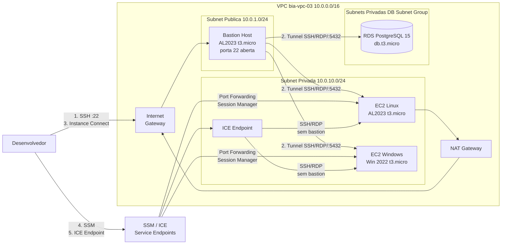

# Desafio 03: EC2 + SSH + SSM + Instance Connect

> Dominar os cinco modelos de conectividade para EC2 na AWS, compreendendo as particularidades, o fluxo de informacoes e os trade-offs de seguranca de cada abordagem: SSH direto, Bastion Host com tunnel SSH, EC2 Instance Connect, SSM Session Manager e EC2 Instance Connect Endpoint.

[](https://aws.amazon.com/)
[](#)
[](#)
[](https://www.terraform.io/)

---

## Sobre o Desafio

| Campo | Valor |
|---|---|
| **Numero** | 03 |
| **Trilha** | Conectividade e Redes na AWS (Mai/2026) |
| **Nivel** | Intermediario (Linear) |
| **Data limite do post** | 01/06/2026 |
| **Carga estimada** | 22h22 |
| **Tag identificadora** | `Challenge=mai2026-desafio-03` |
| **Recursos provisionados** | 42 (terraform apply) |
| **Custo da sessao** | ~$0,30 (sessao de 3h) |

---

## Arquitetura


### Visao geral do ambiente



### Estrutura do repositorio

```text
desafio_03_ec2_ssm_ssh/
├── ai/              # PRD.md, ADRs (decisoes arquiteturais)
├── terraform/       # IaC: vpc, nat-gateway, EC2, RDS, ICE Endpoint, IAM, SGs
├── ansible/         # Inventario pos-provisionamento
├── docs/            # architecture.py, architecture.png, PRINTS/, BLOG_POST.md
├── scripts/         # validate.sh, cleanup.sh, prints.sh
├── Makefile         # Atalhos: init, plan, apply, diagram, validate, destroy
└── README.md        # Este arquivo
```

---

## Os 5 Metodos de Conectividade

Este desafio demonstra na pratica cinco abordagens distintas para acessar instancias EC2, cada uma com um perfil diferente de seguranca, operacao e custo.

| Metodo | Porta aberta? | Requer IP publico? | Ideal quando |
|---|:---:|:---:|---|
| **1. SSH Direto** | Sim (22) | Sim | Prototipagem rapida, instancia publica |
| **2. Bastion + Tunnel SSH** | Sim (bastion) | Bastion apenas | Instancias privadas, modelo legado |
| **3. EC2 Instance Connect** | Nao* | Sim (browser) | Acesso pontual sem chave pem fixa |
| **4. SSM Session Manager** | Nao | Nao | Producao, auditoria, escala, sem IP |
| **5. ICE Endpoint** | Nao | Nao | Privado sem bastion EC2, RDP incluso |

> *Instance Connect injeta uma chave temporaria valida por 60 segundos via API da AWS.

### Comparativo de seguranca

| Metodo | Surface de ataque | Auditoria | Custo adicional |
|---|---|:---:|---|
| SSH Direto | Porta 22 exposta | Nenhuma | Nenhum |
| Bastion + Tunnel | Porta 22 no bastion | Nenhuma | EC2 bastion rodando |
| Instance Connect | Zero (chave temporaria) | Parcial (CloudTrail) | Nenhum |
| SSM Session Manager | Zero | Completa (Session Manager + CloudTrail) | Nenhum* |
| ICE Endpoint | Zero | Parcial (CloudTrail) | ~$0,01/h por endpoint |

> *SSM requer NAT Gateway ou VPC Endpoints para instancias em subnet privada.

---

## Recursos Provisionados

| Recurso | Nome | Proposito |
|---|---|---|
| VPC | `bia-vpc-03` | Rede isolada 10.0.0.0/16 |
| Subnets publicas (2) | `bia-vpc-03-public-1a/1b` | Bastion + NAT Gateway |
| Subnets privadas (2) | `bia-vpc-03-private-1a/1b` | Workloads + DB Subnet Group |
| NAT Gateway | `bia-03-nat-1` | Saida internet para SSM Agent |
| Key Pair Linux | `bia-lab-03` | Ed25519 para instancias Linux |
| Key Pair Windows | `bia-lab-03-win` | RSA (Windows nao suporta Ed25519) |
| IAM Role + Profile | `bia-ssm-role-03` | AmazonSSMManagedInstanceCore |
| Security Groups (4) | `sg-bastion/ec2-private/ice/rds` | Isolamento por camada |
| EC2 Bastion | `bia-03-bastion` | Jump host publico, t3.micro AL2023 |
| EC2 Linux | `bia-03-ec2-linux-private` | Alvo privado, t3.micro AL2023 |
| EC2 Windows | `bia-03-ec2-windows-private` | Alvo privado, t3.micro Win 2022 |
| RDS PostgreSQL | `bia-03-postgres` | Banco privado, db.t3.micro, pg15 |
| ICE Endpoint | `eice-0ef16ab6824bcb6fb` | Acesso privado sem bastion EC2 |

---

## Decisoes Tecnicas (ADRs)

Detalhes completos em [`ai/ADR/`](ai/ADR/).

**ADR-001 - Ambiente unico consolidado**
Um unico `terraform apply` provisiona todos os recursos que cobrem os 5 metodos simultaneamente. Alternativa descartada: ambientes separados por aula (mais custo, mais complexidade de gerenciamento).

**ADR-002 - Windows EC2 como opcional por variavel**
`enable_windows = true` por padrao. Variavel `bool` permite desabilitar para economizar custo (~50% mais caro que Linux) quando o objetivo e apenas validar os metodos de acesso Linux/DB.

**ADR-003 - SSM via NAT Gateway (nao VPC Endpoints)**
NAT Gateway ja e necessario para o ambiente. Tres VPC Endpoints para SSM custariam ~$0,03/h a mais. VPC Endpoints sao tema especifico do Desafio 06.

**ADR-004 - RDS PostgreSQL no escopo**
O banco e necessario para validar os metodos 2 (tunnel SSH para porta 5432) e 4 (SSM Port Forwarding para host remoto). Sem o RDS, dois dos cenarios mais educativos ficam sem evidencia.

**ADR-005 - Chave RSA separada para Windows**
Windows AMIs nao suportam Ed25519. Criado `aws_key_pair.windows_lab` (RSA 4096) para a instancia Windows. A chave RSA tambem e necessaria para descriptografar a senha inicial do Administrator via console AWS.

---

## Guia de Execucao

### Pre-requisitos

- Credenciais AWS configuradas (`aws sts get-caller-identity`)
- Terraform >= 1.5 instalado
- Session Manager Plugin instalado (`session-manager-plugin --version`)
- AWS CLI >= 2.12 (para `ec2-instance-connect open-tunnel`)

### Gerando os key pairs

```bash
# Linux (Ed25519)
ssh-keygen -t ed25519 -f ~/.ssh/bia-lab-03 -N ""

# Windows (RSA obrigatorio)
ssh-keygen -t rsa -b 4096 -f ~/.ssh/bia-lab-03-win -N ""

# Converter para PEM (necessario para Get Windows Password no console)
ssh-keygen -p -m PEM -f ~/.ssh/bia-lab-03-win -N "" -P ""
```

### Provisionamento

```bash
cd terraform/
cp terraform.tfvars.example terraform.tfvars
# edite terraform.tfvars com sua senha RDS (sem / @ " ou espaco)

make init    # terraform init
make plan    # terraform plan -out=tfplan
make apply   # terraform apply tfplan
```

### Os 5 metodos em pratica

**1. SSH direto ao bastion:**
```bash
ssh -i ~/.ssh/bia-lab-03 ec2-user@<BASTION_IP>
```

**2. Bastion + tunnel SSH para EC2 privada:**
```bash
# Terminal 1: abre tunnel
ssh -i ~/.ssh/bia-lab-03 -L 2222:<EC2_LINUX_IP>:22 ec2-user@<BASTION_IP> -N -f
# Terminal 2: conecta via tunnel
ssh -i ~/.ssh/bia-lab-03 -p 2222 ec2-user@localhost
```

**2b. Bastion + tunnel para RDS:**
```bash
ssh -i ~/.ssh/bia-lab-03 -L 5433:<RDS_ENDPOINT>:5432 ec2-user@<BASTION_IP> -N -f
psql -h localhost -p 5433 -U postgres -d labdb
```

**3. EC2 Instance Connect (sem chave):**
```bash
aws ec2-instance-connect ssh --instance-id <BASTION_ID> --os-user ec2-user --region us-east-1
```

**4. SSM Session Manager:**
```bash
aws ssm start-session --target <EC2_LINUX_ID> --region us-east-1
```

**4b. SSM Port Forwarding para RDS:**
```bash
aws ssm start-session --target <EC2_LINUX_ID> \
  --document-name AWS-StartPortForwardingSessionToRemoteHost \
  --parameters "{\"host\":[\"<RDS_ENDPOINT>\"],\"portNumber\":[\"5432\"],\"localPortNumber\":[\"5433\"]}" \
  --region us-east-1
```

**5. ICE Endpoint para EC2 Linux privada:**
```bash
# Terminal 1: abre tunnel via ICE
aws ec2-instance-connect open-tunnel --instance-id <EC2_LINUX_ID> --remote-port 22 --local-port 2222 --region us-east-1
# Terminal 2: SSH pela porta local
ssh -i ~/.ssh/bia-lab-03 -p 2222 ec2-user@localhost
```

> Todos os comandos com valores reais sao gerados automaticamente pelo `terraform output` apos o apply.

### Destroy

```bash
make destroy   # terraform destroy (confirmar com "yes")
```

---

## Seguranca e Tags

### Security Groups: isolamento por camada

| SG | Ingress permitido | Egress |
|---|---|---|
| `sg-bastion` | 22 de 0.0.0.0/0 | Tudo |
| `sg-ec2-private` | 22/3389 de sg-bastion; 22/3389 de sg-ice-endpoint | Tudo |
| `sg-ice-endpoint` | Nenhum | 22/3389 para sg-ec2-private |
| `sg-rds` | 5432 de sg-bastion; 5432 de sg-ec2-private | Nenhum |

> Regras de SG com referencia cruzada entre `sg-ec2-private` e `sg-ice-endpoint` foram implementadas via `aws_security_group_rule` separados para evitar dependencia circular no Terraform.

### Tags Well-Architected (7 obrigatorias)

```hcl
common_tags = {
  Project      = "formacao-aws"
  Environment  = "lab"
  Owner        = "nilo-lima-jr"
  ManagedBy    = "terraform"
  Challenge    = "mai2026-desafio-03"
  CostCenter   = "formacao-aws-mai2026"
  AutoShutdown = "true"
}
```

---


## Custos Reais

Sessao de lab de aproximadamente 3 horas em us-east-1:

| Servico | Custo/hora | Sessao 3h |
|---|---:|---:|
| NAT Gateway | $0,045 | $0,14 |
| RDS db.t3.micro | $0,017 | $0,05 |
| EC2 t3.micro x 2 | $0,020 | $0,06 |
| ICE Endpoint | $0,010 | $0,03 |
| EIP | $0,005 | $0,02 |
| **Total estimado** | | **~$0,30** |

---

## Licoes Aprendidas

- **Ed25519 nao funciona com Windows AMIs**: a AWS exige RSA para instancias Windows, tanto para o key pair quanto para descriptografar a senha inicial do Administrator. Necessario criar um key pair RSA separado.
- **SSM requer NAT Gateway em subnets privadas**: sem rota de saida para internet, o SSM Agent nao consegue registrar a instancia. A alternativa sem NAT sao os VPC Endpoints (tema do Desafio 06).
- **Dependencia circular nos Security Groups**: `sg-ec2-private` e `sg-ice-endpoint` se referenciam mutuamente. A solucao e criar os SGs sem regras inline e usar `aws_security_group_rule` como recursos separados.
- **ICE Endpoint serve toda a VPC**: um unico endpoint cobre todas as subnets e instancias da VPC, nao apenas a subnet onde foi criado.
- **Senha do RDS tem caracteres proibidos**: os caracteres `/`, `@`, `"` e espaco sao rejeitados pelo RDS. Descoberto apenas na hora do apply, apos o plano ter passado.
- **SSM Port Forwarding e o metodo mais versatil**: com um unico comando, redireciona SSH, RDP ou qualquer porta TCP sem abrir nenhuma porta de rede diretamente.

---

## Apoie este Projeto Open Source

Se voce gosta dos meus projetos, considere:

- Me indicar para o GitHub Stars: [Indicar Aqui](https://stars.github.com/nominate/)
- Dar uma estrela no repositorio
- Reportar bugs ou melhorias
- Contribuir com codigo
- Visitar meu perfil: [@nilo-lima](https://github.com/nilo-lima)

## Licenca

Distribuido sob a licenca **Apache 2.0**. Veja [LICENSE](../LICENSE) na raiz.

---

<div align="center">
  <sub>
    Desafio 03 de 6 - Trilha
    <strong>Conectividade e Redes na AWS</strong>
    - Mentoria
    <a href="https://hotmart.com/pt-br/club/formacaoaws">Formacao AWS 5.0 - Henrylle Maia</a>
  </sub>
</div>
