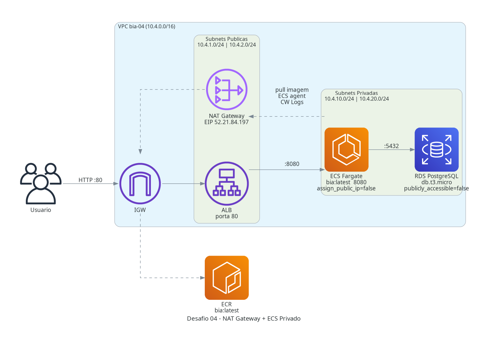
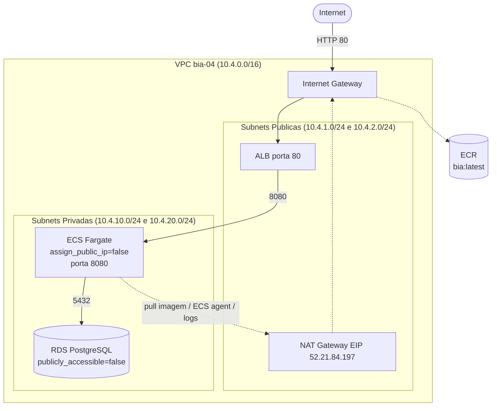

# Desafio 04: NAT Gateway + ECS Privado

> BIA rodando no ECS Fargate em subnet privada, sem IP publico, com saida de internet exclusivamente via NAT Gateway.

[](https://www.terraform.io/)
[](https://aws.amazon.com/)
[](#)
[](#)

---

## Sobre o Desafio

| Campo | Valor |
|---|---|
| **Numero** | 04 |
| **Trilha** | Conectividade e Redes na AWS (Mai/2026) |
| **Nivel** | 2/3 (Nao linear) |
| **Data limite do post** | 08/06/2026 |
| **Carga estimada** | 1 dia, 3h59 |
| **Tag identificadora** | `Challenge=mai2026-desafio-04` |

## Arquitetura

```text
desafio_04_nat_gateway/
├── ai/              # PRD.md, ADRs
├── terraform/       # IaC (consome shared/modules)
├── docs/            # architecture.py, architecture.png, PRINTS
├── scripts/         # validate.sh, cleanup.sh
├── Makefile         # Targets: init, plan, apply, push-image, redeploy, destroy
└── README.md        # Este arquivo
```



### Diagrama de Fluxo



### Recursos provisionados (33 total)

| Recurso | Nome | CIDR / Endpoint |
|---|---|---|
| VPC | `bia-04-vpc` | `10.4.0.0/16` |
| Subnet publica A | `bia-04-pub-a` | `10.4.1.0/24` us-east-1a |
| Subnet publica B | `bia-04-pub-b` | `10.4.2.0/24` us-east-1b |
| Subnet privada A | `bia-04-priv-a` | `10.4.10.0/24` us-east-1a |
| Subnet privada B | `bia-04-priv-b` | `10.4.20.0/24` us-east-1b |
| Internet Gateway | `bia-04-igw` | - |
| NAT Gateway | `bia-04-nat` | EIP `52.21.84.197` |
| ALB | `bia-04-alb` | `bia-04-alb-714862263.us-east-1.elb.amazonaws.com` |
| ECS Cluster | `bia-04-cluster` | - |
| ECS Service | `bia-04-svc` | desired_count=1, Fargate |
| RDS PostgreSQL | `bia-04` | `bia-04.ccx4oksoqgoo.us-east-1.rds.amazonaws.com` |
| ECR | `bia` | `507687687616.dkr.ecr.us-east-1.amazonaws.com/bia` |

## Justificativa das Decisoes Tecnicas (ADRs)

Detalhes em [`ai/ADR/`](ai/ADR/).

- **ADR-001 - ECS Fargate vs EC2:** Fargate em `assign_public_ip=false` demonstra o fluxo NAT com menos complexidade operacional. Sem ASG, capacity provider ou user_data para gerenciar - foco 100% no isolamento de rede.
- **ADR-002 - Single NAT Gateway:** Lab com budget de $5 e sessao de ~3h. 1 NAT GW = $0.135 vs 2 NAT GWs = $0.270. Em producao com SLA, 1 NAT por AZ e obrigatorio para HA.
- **ADR-003 - RDS fora do modulo bia-baseline:** O modulo usa SGs orientados a EC2 (`bia-dev`/`bia-web`). Aqui o SG do RDS precisa referenciar o SG do ECS task. Criado diretamente no `main.tf` com `source_security_group_id` correto.

## Guia de Execucao

### Pre-requisitos

- VM Vagrant `formacao-aws` ativa (`make vm-up` na raiz)
- Credenciais AWS configuradas (`aws sts get-caller-identity`)
- Variavel sensivel em `terraform/terraform.tfvars` (nao commitada):

```
rds_password = "SenhaForte12!"
```

### Passo a passo

```bash
make init        # terraform init
make plan        # terraform plan (revisar mudancas)
make apply       # terraform apply (pede confirmacao)
make push-image  # build BIA + patch VITE_API_URL + push ECR
make redeploy    # forca novo deployment ECS, aguarda RUNNING
make diagram     # gera docs/architecture.png
make destroy     # destruir tudo (dupla confirmacao)
```

### Targets disponiveis

| Target | Descricao |
|---|---|
| `init` | terraform init |
| `plan` | terraform plan -out=tfplan.out |
| `apply` | terraform apply tfplan.out |
| `push-image` | build BIA com VITE_API_URL correto + push ECR |
| `redeploy` | force-new-deployment ECS + wait |
| `outputs` | mostra outputs do terraform |
| `diagram` | gera `docs/architecture.png` |
| `cost-report` | custos por servico via Cost Explorer |
| `destroy` | terraform destroy (dupla confirmacao) |

## Seguranca e Tags

Todo recurso carrega 7 tags Well-Architected via `locals.common_tags`:

```hcl
locals {
  common_tags = {
    Project      = "formacao-aws"
    Environment  = "lab"
    Owner        = "nilo-lima-jr"
    ManagedBy    = "terraform"
    Challenge    = "mai2026-desafio-04"
    CostCenter   = "formacao-aws-mai2026"
    AutoShutdown = "true"
  }
}
```

### Postura de seguranca

| Controle | Configuracao |
|---|---|
| ECS task - IP publico | `assign_public_ip = false` |
| RDS - acesso publico | `publicly_accessible = false` |
| RDS - criptografia | `storage_encrypted = true` |
| SG RDS | ingresso apenas do SG ECS (source-SG, sem CIDR aberto) |
| SG ECS | ingresso apenas do SG ALB na porta 8080 |
| SG ALB | ingresso 0.0.0.0/0 somente na porta 80 |
| Senha RDS | `sensitive = true`, nunca em .tf versionado |

## Outputs Terraform

```
alb_dns_name        = "bia-04-alb-714862263.us-east-1.elb.amazonaws.com"
ecr_repository_url  = "507687687616.dkr.ecr.us-east-1.amazonaws.com/bia"
ecs_cluster_name    = "bia-04-cluster"
ecs_service_name    = "bia-04-svc"
nat_eip             = ["52.21.84.197"]
rds_endpoint        = "bia-04.ccx4oksoqgoo.us-east-1.rds.amazonaws.com"
vpc_id              = "vpc-0fbd7a94e4e0d8894"
```

## Custos Reais Apurados

| Servico | Custo USD | Periodo |
|---|---:|---|
| NAT Gateway | ~$0.14 | 3h |
| ECS Fargate | ~$0.01 | 3h |
| RDS db.t3.micro | ~$0.05 | 3h |
| ALB | ~$0.02 | 3h |
| ECR | ~$0.00 | menos de 1GB |
| **Total estimado** | **~$0.22** | 3h |

Detalhes em [`docs/CUSTOS.md`](docs/CUSTOS.md).

> NAT Gateway e o servico mais caro: $0.045/h + $0.045/GB de dados processados.
> Sempre executar `make destroy` apos o lab.

## Perguntas Sugeridas ao Kiro

Veja [`docs/KIRO_PERGUNTAS.md`](docs/KIRO_PERGUNTAS.md). Resumo:

1. Listar todos os recursos criados pela tag `Challenge=mai2026-desafio-04`
2. Verificar se a task ECS nao tem IP publico
3. Confirmar que o NAT Gateway tem EIP associada e esta AVAILABLE
4. Apurar custo real do NAT GW via Cost Explorer

## Licoes Aprendidas

1. **NAT Gateway e obrigatorio para Fargate em subnet privada** - sem ele o container nao consegue puxar imagem do ECR nem se comunicar com o ECS control plane. O servico fica em STOPPED indefinidamente sem log de erro obvio.
2. **Migrations via ECS run-task** - sem ECS Exec habilitado, o caminho mais limpo para rodar `sequelize db:migrate` e um `aws ecs run-task` com command override usando as mesmas env vars (DB_HOST, DB_PWD etc.) ja configuradas na task definition.
3. **sequelize-cli como devDependency sobrevive ao prune** - o `npm prune --production` no Dockerfile da BIA so poda o `client/`. O root `node_modules/.bin/sequelize` permanece disponivel.
4. **Single NAT vs HA** - em lab, single NAT poupa $0.135 em 3h. Em producao, a falha de 1 AZ derruba a saida de internet de metade das tasks.

## Proximos Passos

- [x] Fase 1 - Briefing e Design
- [x] Fase 2 - Terraform (33 recursos)
- [x] Fase 3 - push-image + redeploy ECS
- [x] Fase 4 - Validacao e evidencias
- [x] Fase 5 - Publicacao
- [ ] `make destroy` apos coleta de prints para evitar custos

---

## Apoie este Projeto Open Source

Se voce gosta dos meus projetos, considere:

- Me indicar para o GitHub Stars: [Indicar Aqui](https://stars.github.com/nominate/)
- Dar uma estrela no repositorio
- Contribuir com codigo
- Visitar meu perfil: [@nilo-lima](https://github.com/nilo-lima)

## Licenca

Distribuido sob a licenca **Apache 2.0**. Veja [LICENSE](../LICENSE) na raiz.

---

<div align="center">
  <sub>
    Desafio 04 de 6 - Trilha
    <strong>Conectividade e Redes na AWS</strong>
    - Mentoria
    <a href="https://hotmart.com/pt-br/club/formacaoaws">Formacao AWS 5.0 - Henrylle Maia</a>
  </sub>
</div>
