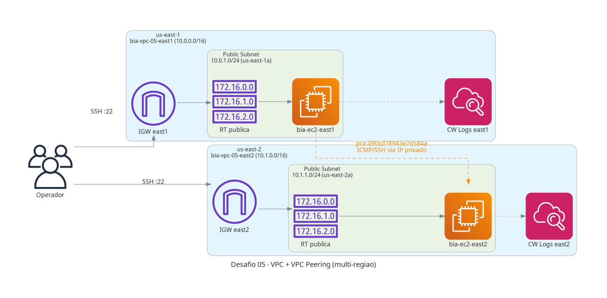
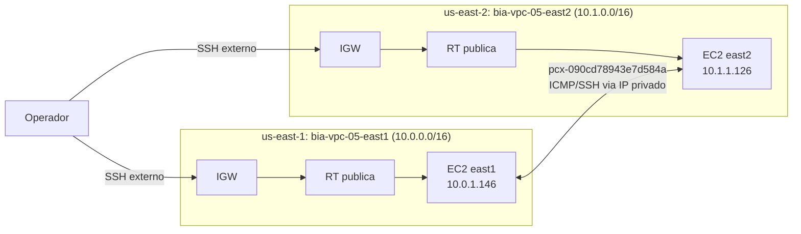

# Desafio 05: VPC + VPC Peering (multi-regiao)

> Comunicacao cross-region entre us-east-1 e us-east-2 via VPC Peering, com validacao ICMP/SSH usando IPs privados.

[](https://www.terraform.io/)
[](https://aws.amazon.com/)
[](#)
[](#)

---

## Sobre o Desafio

| Campo | Valor |
|---|---|
| **Numero** | 05 |
| **Trilha** | Conectividade e Redes na AWS (Mai/2026) |
| **Nivel** | 3/3 (Linear) |
| **Data limite do post** | 08/06/2026 |
| **Carga estimada** | 12h29 |
| **Tag identificadora** | `Challenge=mai2026-desafio-05` |
| **Recursos provisionados** | 22 (terraform apply) |
| **Custo real** | ~$0.06 (sessao ~2h) |

## Arquitetura



### Diagrama de Fluxo



## Decisoes Tecnicas (ADRs)

Detalhes em [`ai/ADR/`](ai/ADR/).

- **ADR-001 - Dual-provider Terraform com aliases de regiao:** dois blocos `provider "aws"` com aliases `useast1`/`useast2` no root module, mantendo estado unificado em um unico `terraform.tfstate`.
- **ADR-002 - CIDRs nao sobrepostos por design (`10.N.0.0/16`):** east1 usa `10.0.0.0/16` e east2 usa `10.1.0.0/16`, eliminando qualquer risco de overlap que impediria o peering.
- **ADR-003 - EC2 em subnet publica sem NAT Gateway:** o trafego de validacao usa IPs privados via peering; o IGW serve apenas para SSH do operador, reduzindo custo ~5x.
- **ADR-004 - Aceitacao automatica do peering via `aws_vpc_peering_connection_accepter`:** torna o fluxo 100% automatizado e idempotente sem intervencao manual no console.

## Guia de Execucao

### Pre-requisitos

- Credenciais AWS configuradas (`aws sts get-caller-identity`)
- Variáveis sensíveis em `terraform/terraform.tfvars` (nao commitado - ver `.example`)
- Chave SSH gerada: `ssh-keygen -t rsa -b 4096 -f ~/.ssh/bia-05`

### Passo a passo

```bash
make init       # terraform init
make plan       # terraform plan (revisar mudancas)
make apply      # terraform apply (pede confirmacao)
make diagram    # gera architecture.png
make validate   # tflint + tfsec + smoke tests
make destroy    # destruir recursos (dupla confirmacao)
```

### Targets disponíveis

| Target | Descricao |
|---|---|
| `init` | terraform init |
| `plan` | terraform plan |
| `apply` | terraform apply |
| `diagram` | gera `docs/architecture.png` |
| `validate` | tflint + tfsec |
| `destroy` | terraform destroy (dupla confirmacao) |

### Outputs do apply

```
cmd_ping_east2_from_east1  = "ping -c 4 10.1.1.126"
cmd_ssh_east1              = "ssh -i ~/.ssh/bia-05 ec2-user@<public-ip>"
cmd_ssh_east2              = "ssh -i ~/.ssh/bia-05 ec2-user@<public-ip>"
cmd_ssh_east2_via_peering  = "ssh -i ~/.ssh/bia-05 ec2-user@10.1.1.126"
peering_connection_id      = "pcx-090cd78943e7d584a"
peering_connection_status  = "active"
vpc_east1_cidr             = "10.0.0.0/16"
vpc_east2_cidr             = "10.1.0.0/16"
```

## Validacao

Tres testes de smoke executados com sucesso:

| Teste | Comando | Resultado |
|---|---|:---:|
| SSH externo east1 | `ssh -i ~/.ssh/bia-05 ec2-user@<ip-publico>` | PASS |
| Ping east2 via peering | `ping -c 4 10.1.1.126` (executado dentro da east1) | PASS |
| SSH east2 via peering | `ssh ec2-user@10.1.1.126` (agent forward, dentro da east1) | PASS |

O trafego de validacao trafega exclusivamente via IPs privados atraves do VPC Peering, sem passar pela internet publica.

## Seguranca e Tags

Todo recurso carrega 7 tags Well-Architected via `locals.common_tags`:

```hcl
locals {
  common_tags = {
    Project      = "formacao-aws"
    Environment  = "lab"
    Owner        = "nilo-lima-jr"
    ManagedBy    = "terraform"
    Challenge    = "mai2026-desafio-05"
    CostCenter   = "formacao-aws-mai2026"
    AutoShutdown = "true"
  }
}
```

Security Groups:
- SSH externo `:22` restrito ao `admin_cidr` do operador (seu IP/32)
- SSH via peering restrito ao CIDR da VPC par (`10.0.0.0/16` ou `10.1.0.0/16`)
- ICMP liberado apenas entre VPCs peered

## Custos Reais Apurados

| Servico | Custo USD | Periodo |
|---|---:|---|
| EC2 t3.micro (x2) | ~$0.04 | Sessao ~2h |
| Data Transfer cross-region | ~$0.01 | Sessao ~2h |
| CloudWatch Logs | ~$0.01 | Sessao ~2h |
| **Total** | **~$0.06** | Sessao ~2h |

Detalhes em [`docs/CUSTOS.md`](docs/CUSTOS.md).

## Perguntas Sugeridas ao Kiro

Veja [`docs/KIRO_PERGUNTAS.md`](docs/KIRO_PERGUNTAS.md). Resumo:

1. Listar todos os recursos com tag `Challenge=mai2026-desafio-05`
2. Custos detalhados nas ultimas 24h e 72h
3. Verificar SGs com 0.0.0.0/0 em portas nao-padrao
4. Confirmar que o peering esta no estado `active` e rotas corretas nas route tables

## Licoes Aprendidas

1. **VPC Peering cross-region nao suporta `auto_accept = true`** no recurso requester: e necessario usar `aws_vpc_peering_connection_accepter` com o provider da regiao accepter.
2. **Rotas precisam de `depends_on` explicito** no accepter: sem isso, o `apply` tenta criar as rotas antes do peering estar `active` e falha com `InvalidVpcPeeringConnectionID`.
3. **SSH agent forwarding** (`ssh -A`) e a forma mais simples de testar SSH via peering sem copiar a chave privada para a instancia.
4. **CIDRs nao sobrepostos sao prerequisito hard**: o Terraform falha imediatamente na criacao do peering se houver qualquer sobreposicao de CIDR.
5. **Dois providers com alias** em um unico root module permite gerenciar multi-regiao sem workspaces separados, mantendo `apply`/`destroy` atomicos.

## Proximos Passos

- [x] Fase 1 - Briefing e Design
- [x] Fase 2 - Provisionamento IaC (22 recursos)
- [x] Fase 4 - Validacao (3 smoke tests)
- [x] Fase 5 - Documentacao e Publicacao
- [ ] Desafio 06: VPC Endpoint + SSM + Instance Connect

## Apoie este Projeto Open Source

- Dar uma estrela no repositorio
- Reportar bugs ou melhorias via Issues
- Visitar meu perfil: [@nilo-lima](https://github.com/nilo-lima)

## Licenca

Distribuido sob a licenca **Apache 2.0**. Veja [LICENSE](../LICENSE) na raiz.

---

<div align="center">
  <sub>
    Desafio 05 de 6 · Trilha
    <strong>Conectividade e Redes na AWS</strong>
    · Mentoria
    <a href="https://hotmart.com/pt-br/club/formacaoaws">Formacao AWS 5.0 - Henrylle Maia</a>
  </sub>
</div>
