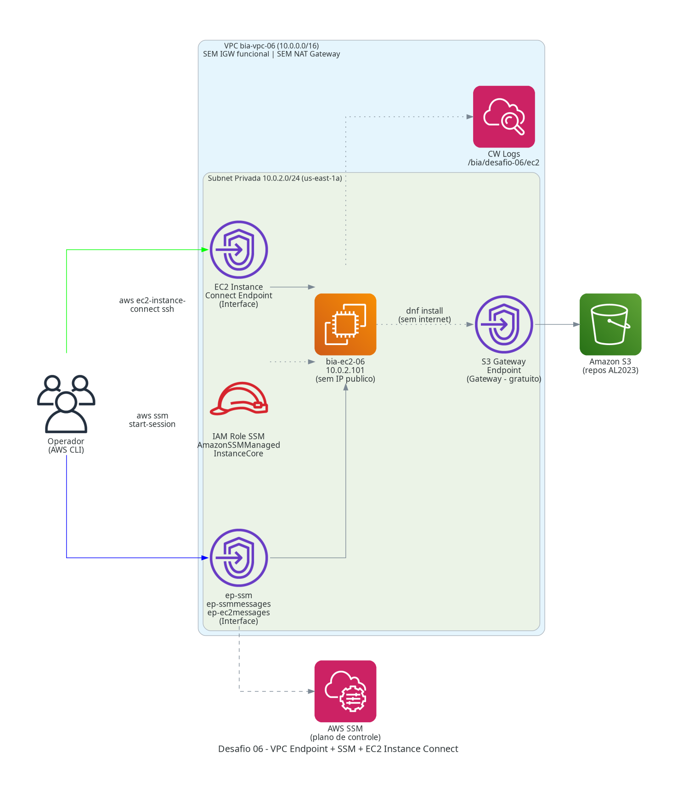
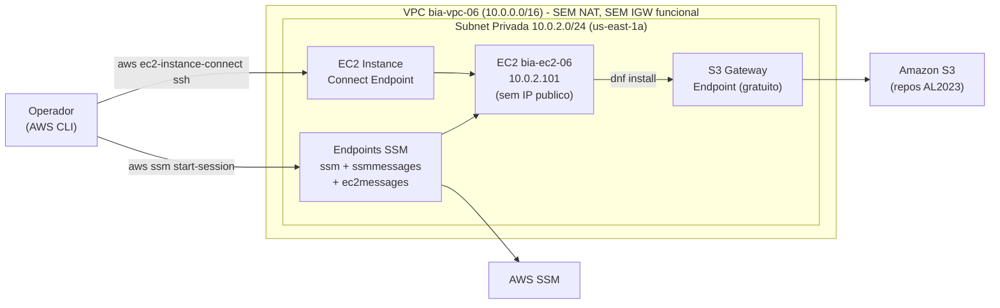

# Desafio 06: VPC Endpoint + SSM + EC2 Instance Connect

> EC2 em subnet 100% privada, sem NAT Gateway, sem IP publico - gerenciada exclusivamente via SSM Session Manager e EC2 Instance Connect Endpoint.

[](https://www.terraform.io/)
[](https://aws.amazon.com/)
[](#)
[](#)

---

## Sobre o Desafio

| Campo | Valor |
|---|---|
| **Numero** | 06 |
| **Trilha** | Conectividade e Redes na AWS (Mai/2026) |
| **Nivel** | 3/3 (Nao linear) |
| **Data limite do post** | 08/06/2026 |
| **Carga estimada** | 7h29 |
| **Tag identificadora** | `Challenge=mai2026-desafio-06` |
| **Recursos provisionados** | 18 (terraform apply) |
| **Custo real** | ~$0.10 (sessao ~2h) |

## Arquitetura



### Diagrama de Fluxo



## Decisoes Tecnicas (ADRs)

Detalhes em [`ai/ADR/`](ai/ADR/).

- **ADR-001 - VPC somente com subnet privada:** sem IGW funcional, sem NAT Gateway. O modulo shared/modules/vpc cria um IGW por design, mas ele e inert: nenhuma subnet usa a RT publica.
- **ADR-002 - SSM Session Manager vs Bastion Host:** sem EC2 extra, sem porta 22 exposta ao internet, auditoria nativa via CloudTrail. 3 endpoints Interface custam o equivalente a um bastion t3.micro.
- **ADR-003 - EC2 Instance Connect Endpoint vs SSH direto:** SSH para instancias privadas via IAM, sem VPN, sem IP publico, sem copiar chaves privadas.
- **ADR-004 - S3 Gateway Endpoint gratuito:** Amazon Linux 2023 busca pacotes em repos S3. Gateway endpoint e gratuito e permite `dnf install` sem NAT.

## Guia de Execucao

### Pre-requisitos

- Credenciais AWS configuradas (`aws sts get-caller-identity`)
- AWS CLI v2 instalada (necessaria para `aws ec2-instance-connect ssh`)
- Nenhuma variavel sensivel necessaria - todos os valores tem default

### Passo a passo

```bash
make init       # terraform init
make plan       # terraform plan
make apply      # terraform apply
make diagram    # gera architecture.png
make destroy    # destruir recursos (dupla confirmacao)
```

### Outputs do apply

```
instance_id          = "i-0c28282cb4f6d26f5"
instance_private_ip  = "10.0.2.101"
cmd_ssm_session      = "aws ssm start-session --target i-0c28282cb4f6d26f5 --region us-east-1"
cmd_eic_ssh          = "aws ec2-instance-connect ssh --instance-id i-0c28282cb4f6d26f5 --region us-east-1"
```

## Validacao

Cinco testes de smoke executados com sucesso:

| Teste | Comando | Resultado |
|---|---|:---:|
| SSM registrado | `aws ssm describe-instance-information` | Online |
| SSM Session Manager | `aws ssm start-session` | PASS |
| Sem internet de saida | `curl http://example.com` (dentro da instancia) | timeout PASS |
| Apenas IP privado | `ip addr show ens5` - `10.0.2.101/24` | PASS |
| EC2 Instance Connect Endpoint | `SSH_AUTH_SOCK="" aws ec2-instance-connect ssh` | PASS |
| SSM Port Forward + HTTP | `curl http://localhost:8080` - HTML 200 | PASS |

A instancia nao possui IP publico, nao tem rota de internet e e totalmente gerenciavel via VPC Endpoints.

## Seguranca e Tags

Todo recurso carrega 7 tags Well-Architected via `locals.common_tags`:

```hcl
locals {
  common_tags = {
    Project      = "formacao-aws"
    Environment  = "lab"
    Owner        = "nilo-lima-jr"
    ManagedBy    = "terraform"
    Challenge    = "mai2026-desafio-06"
    CostCenter   = "formacao-aws-mai2026"
    AutoShutdown = "true"
  }
}
```

Security Groups:
- **SG Endpoints:** ingress HTTPS:443 apenas do CIDR da VPC (`10.0.0.0/16`)
- **SG EC2:** ingress SSH:22 apenas do SG dos endpoints (EIC Endpoint); egress HTTPS:443 para endpoints e S3
- Nenhuma regra com source `0.0.0.0/0` em portas de gerenciamento

IAM: `AmazonSSMManagedInstanceCore` - policy gerenciada AWS, minimo necessario para SSM.

## Custos Reais Apurados

| Servico | Custo USD | Periodo |
|---|---:|---|
| EC2 t3.micro | ~$0.02 | Sessao ~2h |
| VPC Endpoints Interface (x3 SSM) | ~$0.06 | Sessao ~2h |
| EC2 Instance Connect Endpoint | ~$0.02 | Sessao ~2h |
| S3 Gateway Endpoint | $0.00 | Gratuito |
| **Total** | **~$0.10** | Sessao ~2h |

Detalhes em [`docs/CUSTOS.md`](docs/CUSTOS.md).

## Perguntas Sugeridas ao Kiro

Veja [`docs/KIRO_PERGUNTAS.md`](docs/KIRO_PERGUNTAS.md). Resumo:

1. Listar VPC Endpoints com estado e tipo
2. Confirmar instancia SSM Online sem IP publico e sem rota de internet
3. Verificar SGs sem regras 0.0.0.0/0 em portas de gerenciamento

## Licoes Aprendidas

1. **SSM Session Manager nao precisa de internet** se os 3 endpoints Interface (ssm, ssmmessages, ec2messages) estiverem ativos com `private_dns_enabled = true`.
2. **EC2 Instance Connect Endpoint demora 3-8 min para provisionar** - e o recurso mais lento desta arquitetura; nao interromper o apply.
3. **`SSH_AUTH_SOCK=""` e necessario** quando o SSH agent tem muitas chaves - sem isso, o servidor desconecta por "too many authentication failures" antes da chave EIC ser tentada.
4. **S3 Gateway Endpoint e gratuito** e permite `dnf install` sem NAT - os repos do Amazon Linux 2023 sao servidos a partir do S3.
5. **O modulo shared/modules/vpc cria IGW mesmo com `public_subnets = []`** - o IGW existe no state mas e inert, pois nenhuma subnet usa a RT publica.

## Proximos Passos

- [x] Fase 1 - Briefing e Design
- [x] Fase 2 - Provisionamento IaC (18 recursos)
- [x] Fase 4 - Validacao (5 smoke tests)
- [x] Fase 5 - Documentacao e Publicacao
- Monorepo concluido: 6/6 desafios entregues

## Apoie este Projeto Open Source

- Dar uma estrela no repositorio
- Reportar bugs ou melhorias via Issues
- Visitar meu perfil: [@nilo-lima](https://github.com/nilo-lima)

## Licenca

Distribuido sob a licenca **Apache 2.0**. Veja [LICENSE](../LICENSE) na raiz.

---

<div align="center">
  <sub>
    Desafio 06 de 6 · Trilha
    <strong>Conectividade e Redes na AWS</strong>
    · Mentoria
    <a href="https://hotmart.com/pt-br/club/formacaoaws">Formacao AWS 5.0 - Henrylle Maia</a>
  </sub>
</div>
