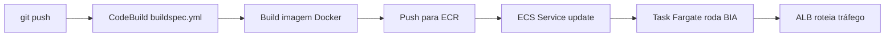

# 🌟 BIA — Visão Geral da Aplicação

> Repo: https://github.com/henrylle/bia
> Curadoria: Henrylle Maia (Formação AWS 5.0)

## Stack Confirmada (via inspeção do repo)

| Camada | Tecnologia | Caminho |
|---|---|---|
| Backend | Node.js + Express + Sequelize ORM | `api/` |
| Frontend | Vite + React | `client/` |
| Banco | PostgreSQL (migrations Sequelize) | `database/migrations/` |
| Container | Docker + Compose (`compose.yml` raiz) | `Dockerfile`, `compose.yml` |
| CI/CD | AWS CodeBuild (`buildspec.yml`) | `buildspec.yml` |
| IDE | Kiro CLI integrado | `.kiro/` |
| Helper STS | `generate-sts-token.sh` (Linux) | raiz |

## Variável de Ambiente Crítica

⚠️ **`VITE_API_URL`** — usada pelo frontend React para localizar a API Express.
O Vite compila o valor em arquivos estáticos no momento do `npm run build` — **não é uma variável de runtime**.

### Problema conhecido: Dockerfile do repo `henrylle/bia` hardcoda `localhost:3001`

O Dockerfile original tem a URL fixada:
```dockerfile
RUN cd client && VITE_API_URL=http://localhost:3001 npm run build
```

Passar `--build-arg VITE_API_URL=...` **não funciona** porque não há diretiva `ARG` no Dockerfile.

### Fix obrigatório antes do build em ECS/ALB

Aplicar os dois patches antes de rodar `docker build`:

```bash
# 1. Declarar o ARG (com default localhost para builds locais)
sed -i '/RUN cd client && VITE_API_URL=http/i ARG VITE_API_URL=http://localhost:3001' Dockerfile

# 2. Substituir URL hardcoded pela variável
sed -i 's|VITE_API_URL=http://localhost:3001 npm run build|VITE_API_URL=${VITE_API_URL} npm run build|' Dockerfile
```

Depois do patch, o build recebe o ALB DNS via `--build-arg`:
```bash
docker build \
  --build-arg VITE_API_URL=http://<ALB_DNS> \
  -t <ECR_URL>:latest .
```

> Este patch é necessário nos desafios **02**, **04** e **06** (qualquer um que use ECS + ALB).

## Portas

| Serviço | Porta Interna | Porta Externa Típica |
|---|:---:|:---:|
| API (Express) | 3001 | 3001 (dev) ou 80 via ALB |
| Frontend (Vite preview) | 8080 | 80 via ALB |
| Postgres | 5432 | 5432 (RDS) |

## Fluxo de Build & Deploy Padrão



## Migrations

Após subir a aplicação no container:

```bash
docker compose exec server bash -c 'npx sequelize db:migrate'
```

## Dependências de Infraestrutura

- **VPC** com pelo menos 1 subnet pública (ou pública+privada com NAT)
- **EC2** ou **ECS Fargate** rodando o container
- **RDS PostgreSQL** acessível (SG permitindo porta 5432 desde a app)
- **IAM Role** com `AmazonSSMManagedInstanceCore` (acesso via Session Manager)
- **ECR** (quando usar ECS) para hospedar a imagem

## Mapeamento Desafios → BIA

| Desafio | Usa BIA? | Como |
|---|:---:|---|
| 01 - VPC + Subnet Pública | ✅ | `bia-dev` EC2 em subnet pública customizada |
| 02 - ECS Público | ✅ | BIA em ECS Fargate Multi-AZ |
| 03 - EC2 SSH/SSM | ❌ | Foca em conectividade, EC2 genérica |
| 04 - NAT Gateway | ✅ | BIA em ECS subnet privada com NAT para internet |
| 05 - VPC Peering | ❌ | Foca em interconectividade entre regiões |
| 06 - VPC Endpoint | ✅ | BIA serverless + endpoints privados |

## Recursos Compartilhados (módulo `shared/modules/bia-baseline`)

Refatoração da pasta `bia-infra/` original. Provisiona apenas a baseline:

- 1× EC2 `bia-dev` (t3.micro) com IAM SSM
- 1× RDS `bia` (db.t3.micro postgres 17.4)
- 3× Security Groups: `bia-dev` (3001), `bia-web` (80), `bia-db` (5432)
- 1× IAM Role `role-acesso-ssm` com policies SSM/RDS/ECR/EC2/ECS

Desafios consomem como módulo: `module "bia_baseline" { source = "../../shared/modules/bia-baseline" }`.
